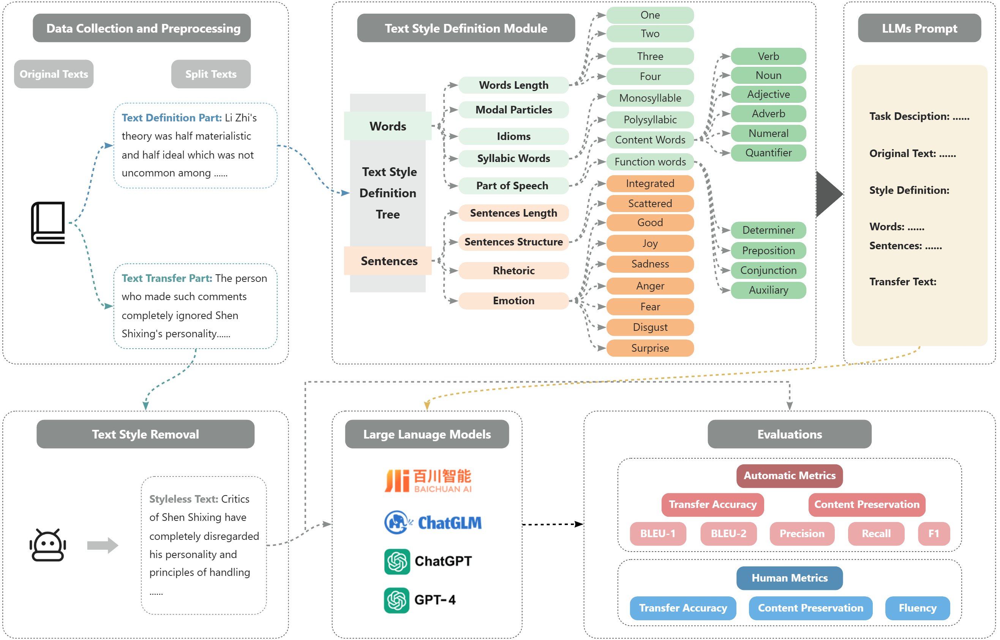

# CAT-LLM: Style-enhanced Large Language Models with TextStyle Definition for Chinese Article-style Transfer



## Introduction
The CAT-LLM framework addresses the challenge of text style transfer in Chinese long texts, a field that has seen limited research compared to English sentence-level style transfer. Leveraging the capabilities of Large Language Models (LLMs), CAT-LLM integrates a bespoke Text Style Definition (TSD) module. This module comprehensively analyzes text features at both the word and sentence levels, ensuring the LLMs can accurately transfer the style of Chinese articles without compromising content integrity. Experimental results demonstrate CAT-LLM's superior performance in transfer accuracy and content preservation, showcasing its broad applicability across various LLMs. The framework introduces a novel evaluation paradigm by creating parallel datasets from five distinct Chinese articles, enhancing the accuracy of performance evaluation. 

## Installation

Before using CAT-LLM:

1. Ensure you have Python 3.8.0+
2. Install the required packages:

    ```bash
    pip install -r requirements.txt
    ```

## How to Run the Program


## Project Structure

The project is organized into several key directories and modules. Here's an overview of the project structure:
```
├── bert-base-chinese                         # Store bert-base-chines file used in our experiment, .<br>
├── data                                      # Store five dataset.<br>
├── Models                                    # Core codebase.<br>
│   ├── Baichuan                              # Three Baichuan operations.<br>
│   ├── ChatGLM                               # Three ChatGLM operations.<br>
│   └── GPT-3.5                               # Three GPT-3.5 operations.<br>
├── sentence_word_define_dataset              # Store sentence_word_define_dataset.<br>
├── TST_sentence                              # Store TST_sentence classification models.<br>
├── ACC_BLEU_BERT                             # Store BLEU_BERT metrics.<br>
├── All_style_define                          # Store TSD module.<br>
└── Content_preserve                          # Store Content_preserve code.<br>
```

## Citation
```
@article{tao2024cat,
  title={CAT-LLM: Prompting Large Language Models with Text Style Definition for Chinese Article-style Transfer},
  author={Tao, Zhen and Xi, Dinghao and Li, Zhiyu and Tang, Liumin and Xu, Wei},
  journal={arXiv preprint arXiv:2401.05707},
  year={2024}
}
```
